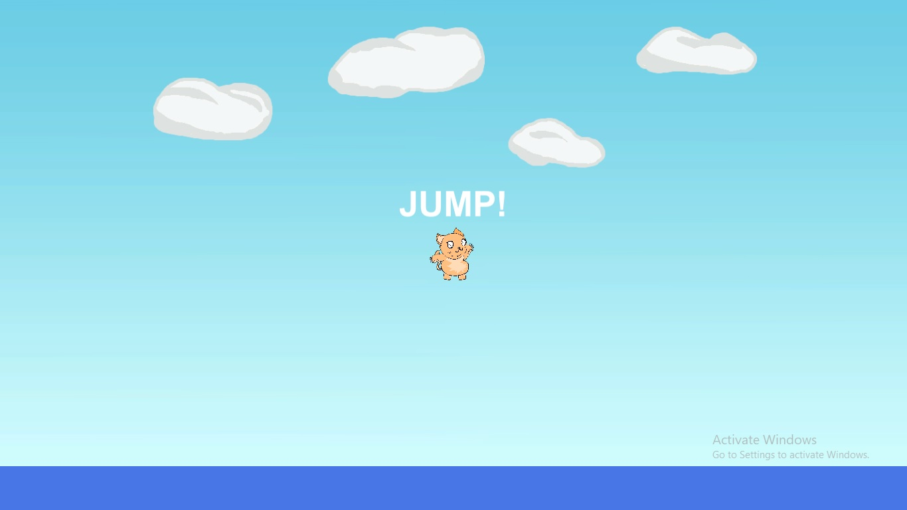
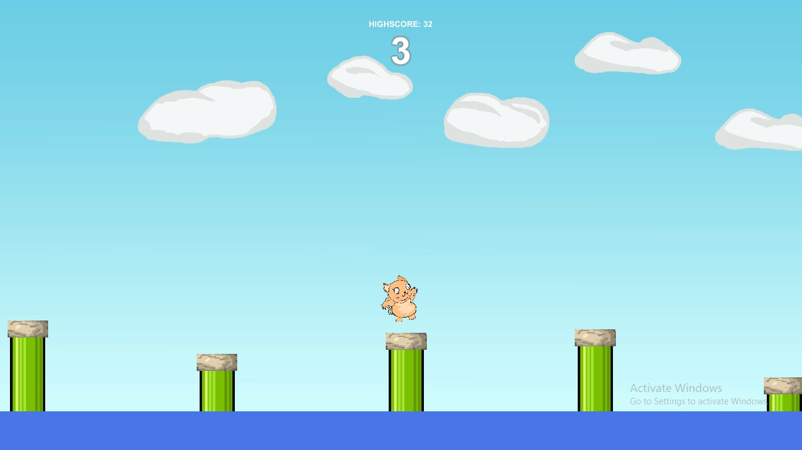
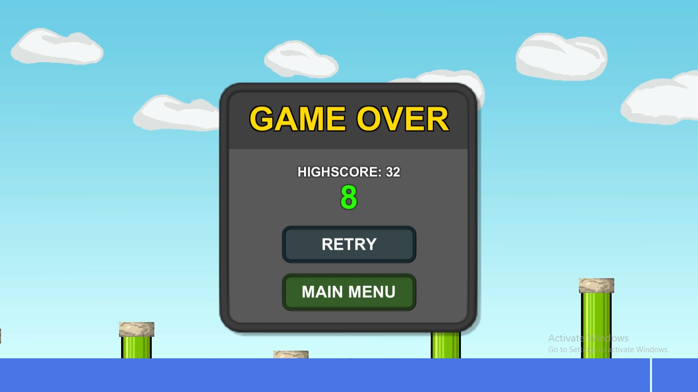
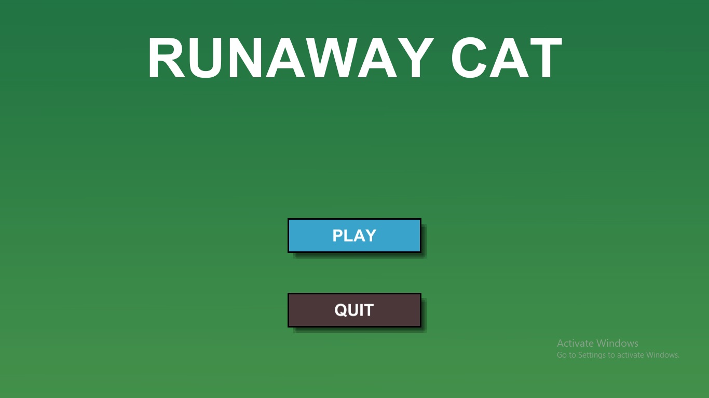

# Runaway Cat
Sebuah permainan yang menceritakan seekor kucing yang melompat-lompat menyeberangi danau untuk mencari peradaban baru.
Gunakan bantuan batu sebagai pijakan agar kalian tidak tercebur ke danau.

Hint: gunakan Left Mouse Button atau Space untuk mengatur jalan jatuhnya kucing

## Latar Belakang

## Pembagian Tugas
Refianto Damai Darmawan (G64170001) - [Programmer I]  
Cindana Putri Ramadhani (G64170022) - [Desginer, PM]  
Nadhir Dhanu Dwinanda   (G64170083) - [Programmer II, tester]

## Screenshot Gameplay
Starting Prompt:  
  

Gameplay:  
  

Game Over:  
  

Main Menu:  
  

## Deskripsi Game dan Cara Memainkan
**Runaway Cat** adalah sebuah permainan yang menceritakan seekor kucing yang melompat-lompat menyeberangi danau untuk mencari peradaban baru.
Gunakan bantuan batu sebagai pijakan agar kalian tidak tercebur ke danau.

Hint: gunakan **Left Mouse Button** atau **Space** untuk mengatur kecepatan jatuhnya kucing

## Teknologi yang digunakan
* Unity 2019.2

## Download Asset untuk dipakai dalam Unity 2019
[Asset Download](RunawayCat.unitypackage)

## Download Game dan CrashHandler
[Game](Game2.exe)
[Crash Handler](UnityCrashHandler32.exe)

## Download Video Demo
[Download Video File](Runaway%20Cat%20-%20Media%20Player%20Classic.mp4)  
[Youtube Version](https://youtu.be/P2KV3KPk15w)
